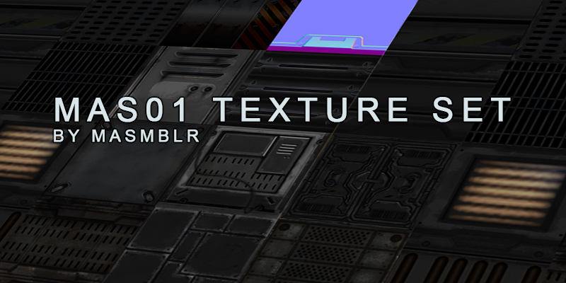

# mas01 Texture Set - Unvanquished Level-Editor-Files

## Overview

The **mas01** texture set is a collection of sci-fi industrial textures designed to create a futuristic, industrial atmosphere with a darker tone.

These files are low-resolution and intended for developing maps for Unvanquished. For final in-game use, use the binary.

## Installation

Copy the contents of the tex-mas01_src.dpkdir directory to the map directory: ../unvanquished/pkg/PROJECTNAME

Additionally, add the string "shared_mas01" to your scripts/shaderlist.txt file.

## License

This texture set is available for non-commercial use under the terms of the **[Creative Commons Attribution-NonCommercial-NoDerivatives 4.0 International License](https://creativecommons.org/licenses/by-nc-nd/4.0/)**.

For a detailed overview of the licensing terms, please refer to the [`license.txt`](LICENSE.txt) file.

## Credits

- **Matthias Peters** (Author, Creator)
