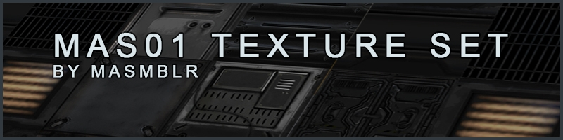

  

## Introduction
The **mas01** texture set is a collection of sci-fi industrial textures designed to create a futuristic, industrial atmosphere with a darker tone.
The textures were used in this [project](https://github.com/Masmblr/map-prometheus_src.dpkdir).

# Overview
| Type | Link | Description |
|--------|----------|-------------|
| source | [click](https://github.com/Masmblr/mas01-Texture-Set/tree/main/src/webp/) | Source files |
| mas01-unvq-dev | [click](https://github.com/Masmblr/mas01-Texture-Set/tree/mas01-unvq-dev)| Unvanquished development files |
| mas01-unvq-bin | [click](https://github.com/Masmblr/mas01-Texture-Set/releases/tag/unvq-bin)| Unvanquished binary |

# Credits & License
A comprehensive list of all files and their respective licenses can be found in the following document:
[→ LICENSE](LICENSE)
